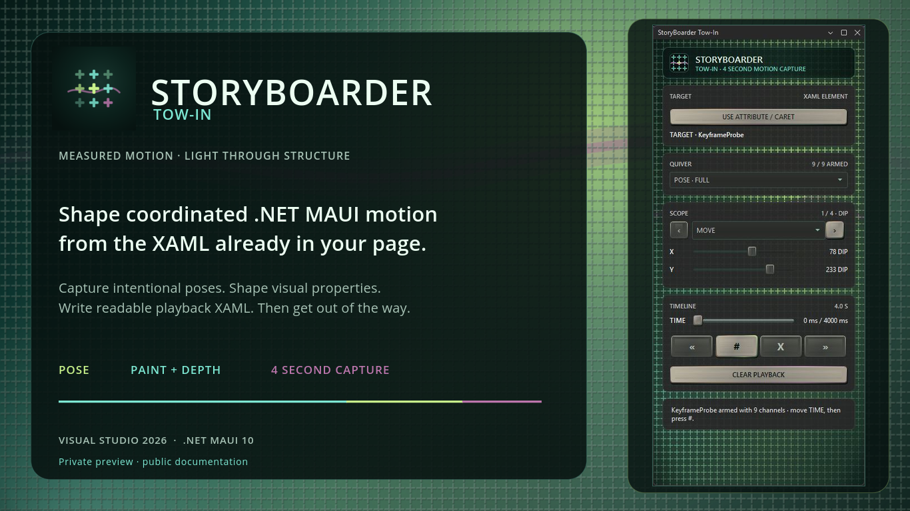
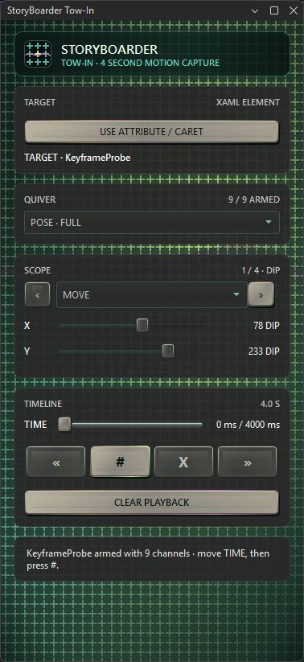

# StoryBoarder

> A compact animation capture deck for .NET MAUI XAML.
>
> **Measured motion. Light through structure.**

StoryBoarder helps a developer shape motion against the XAML they already own. Pick an element and property, pose it at deliberate moments, claim those moments as keyframes, then carry the captured motion into the app's playback experience.

The goal is not to rebuild Blend or introduce another visual-design environment. StoryBoarder stays close to the code and keeps the editing surface small: the developer chooses what matters, while the deck handles the pencil work between poses.

## The deck today

The `0.4.1` public preview carries reusable Pose and Paint + Depth rigs, a
four-second claimed-key timeline, and the GlowcilliScope instrument surface.
This is the current Tow-In window captured from Visual Studio—not a UI mockup.

## Current status

[`StoryBoarder Tow-In` 0.4.1](https://marketplace.visualstudio.com/items?itemName=CodeCrafty.StoryBoarder)
is a free public preview for Visual Studio 2026 Stable and Insiders on amd64.
Install it from the Visual Studio Marketplace or find **StoryBoarder Tow-In**
under **Extensions → Manage Extensions**.

The companion
[`StoryBoarder.Motion` 0.4.0-preview.2 runtime](https://www.nuget.org/packages/StoryBoarder.Motion/0.4.0-preview.2)
is publicly available from NuGet.org so captured playback has a paved
distribution path.

The first launch asks **What's da Password?** Enter `1234`. This is a one-time
courtesy gate for each Visual Studio profile, not a security boundary: the code
is intentionally public and discoverable in the extension. StoryBoarder stores
only the fact that the gate was accepted, not the password.

## The ride

The preview workflow is intentionally direct:

1. Open the .NET MAUI XAML view you want to animate.
2. Choose a named element and one of its animatable properties.
3. Move through the compact timeline and pose the property.
4. Claim the deliberate moments as keyframes.
5. Save the playback definition and verify the motion in the app.

See [Getting started](docs/GETTING_STARTED.md) for installation, first-launch
setup, and the public preview boundary. See [Origin](docs/ORIGIN.md) for the
idea behind the tool.

The Marketplace VSIX and Motion runtime are public binaries. This repository
is their public documentation, media, and licensing home; the authoring
extension's implementation source, internal tester tooling, and release process
remain private.

## Provenance

StoryBoarder was conceived by CodeCrafty and developed in collaboration with BreakerBytes (OpenAI Codex), 2026.

StoryBoarder is distributed under the custom
[StoryBoarder Free Use License 1.0](LICENSE.md): use the unmodified tool freely,
ship applications with its unmodified runtime, and redistribute exact copies
while preserving its origin. Altered, rebranded, and substitute StoryBoarder
implementations are not permitted.
